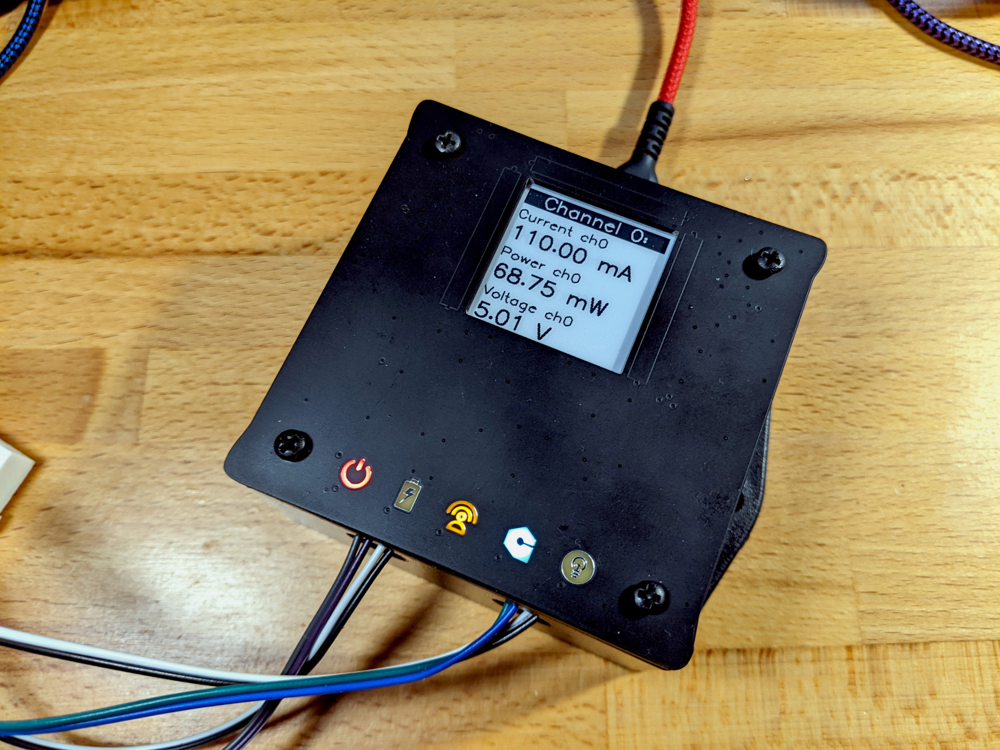

# Zephyr device driver for controlling the Ostentus faceplate



Ostentus is a PCB faceplate for Golioth reference designs that has an ePaper display, indicator
LEDs, and capacitive touch buttons. This driver library allows Zephyr projects to control Ostentus
via an i2c connection.

- Ostentus [hardware repository](https://github.com/golioth/ostentus-hw)
- Ostentus [firmware repository](https://github.com/golioth/ostentus)

Note: Ostentus is a completely optional element in Golioth Reference Designs

## Zephyr requirements

1. Add this module to your west manifest file (usually: west.yml)

    ```yaml
    manifest:
      projects:
        - name: libostentus
          path: deps/modules/lib/libostentus
          revision: main
          url: https://github.com/golioth/libostentus
    ```

2. Add an Ostentus node to you device tree (usually: boards/your-board-name.overlay)

    ```
    &i2c2 {
        /* Needed for I2C writes used by libostentus */
        zephyr,concat-buf-size = <48>;
        ostentus@12 {
            status = "okay";
            compatible = "golioth,ostentus";
            reg = <0x12>;
        };
    };
    ```

3. Get the device and use the API

    ```c
    #include <libostentus.h>
    static const struct device *ostentus = DEVICE_DT_GET_ANY(golioth_ostentus);
    static int some_function(void)
    {
        ostentus_clear_memory(ostentus);
        ostentus_led_power_set(ostentus, 1);
    }
    ```

A more in-depth example of the driver API is available in `example/main.c`
